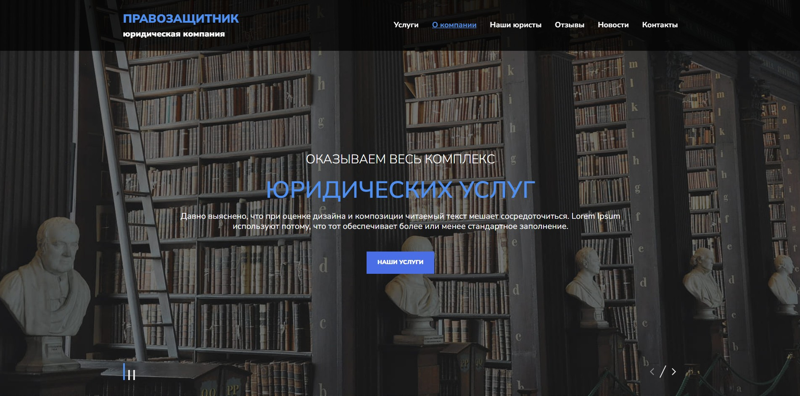

# 📜 Правозащитник - лендинг юридической компании

Одностраничный сайт юридической компании: услуги, юристы, отзывы клиентов, новости и форма обратного звонка

## 🎨 Дизайн

За основу интерфейса был взят дизайн из бесплатного макета Figma.


🔗 [Ссылка на макет в Figma](https://www.figma.com/design/eTEMtLsjPBGYZwP5fpLnkq/lawyer_website?node-id=1-2&p=f&t=dP6Opzmy9kn0PqUB-0)

## ⚙️ Технологии

- **HTML5**
- **CSS3**
- **JavaScript (ES6+)**
- **BEM**
- **Swiper**
- **IMask**

## 🔎 Особенности реализации

- 📱 Адаптивная вёрстка
- 🧑‍🦯 Внимание к доступности — семантическая вёрстка, управление фокусом, поддержка навигации с клавиатуры
- 🧩 Ванильный JavaScript без фреймворков — архитектура на классах
- 📦 Без сборщика — библиотеки подключены как ES-модули напрямую с CDN

## 🎯 Цель проекта

Проект создан для практики вёрстки адаптивных интерфейсов и реализации интерактивных элементов (слайдеры, маски ввода,
модальные окна) на чистом JavaScript без использования фреймворков

## 🚀 Запуск

1. 🔗 [Открыть сайт](https://daniltyrtychnyi.github.io/pravozachitnik/)

2. Клонировать репозиторий:

```bash
git clone git@github.com:daniltyrtychnyi/pravozachitnik.git
```

3. Запустить через локальный сервер — браузеры блокируют ES-модули при открытии `index.html` напрямую через `file://` (ограничение CORS):
    - **Visual Studio Code** —
      расширение [Live Server](https://marketplace.visualstudio.com/items?itemName=ritwickdey.LiveServer), правый клик
      на `index.html` → *Open with Live Server*
    - **WebStorm** — открывается из коробки: значок браузера в правом верхнем углу редактора